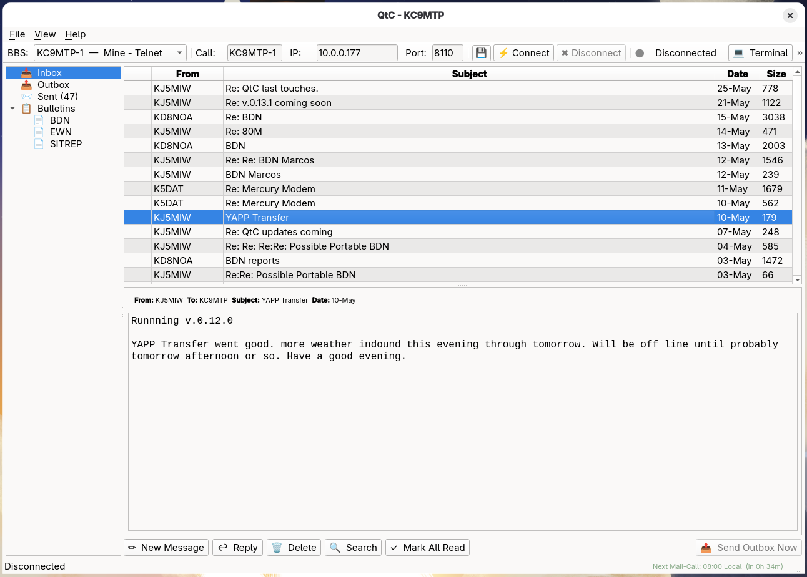
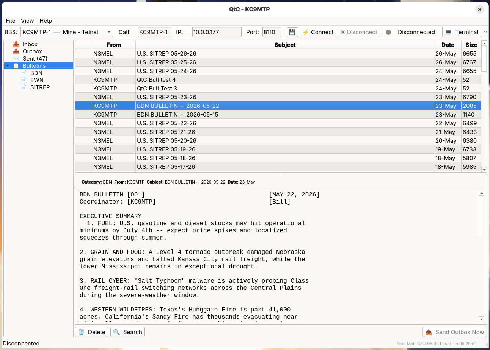
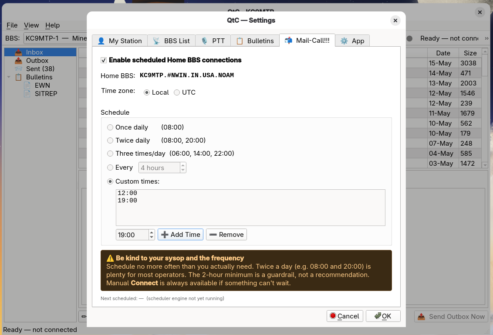
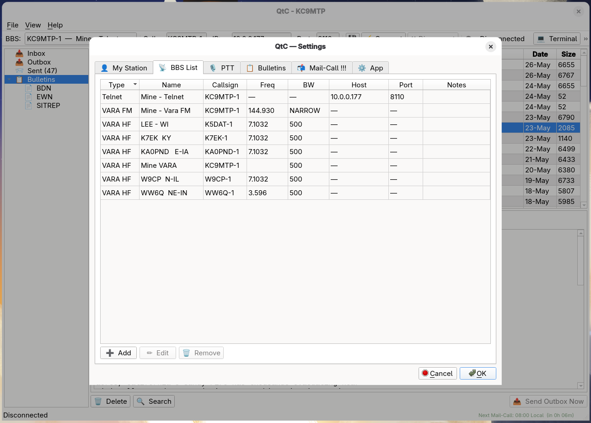
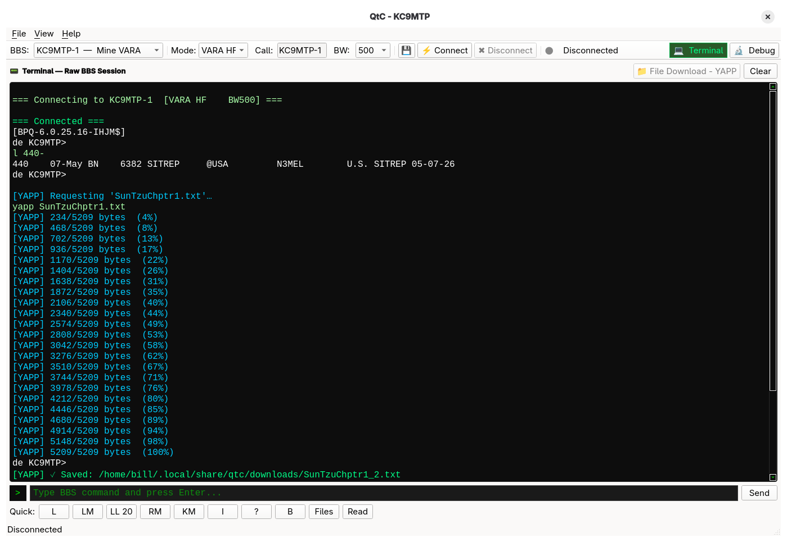
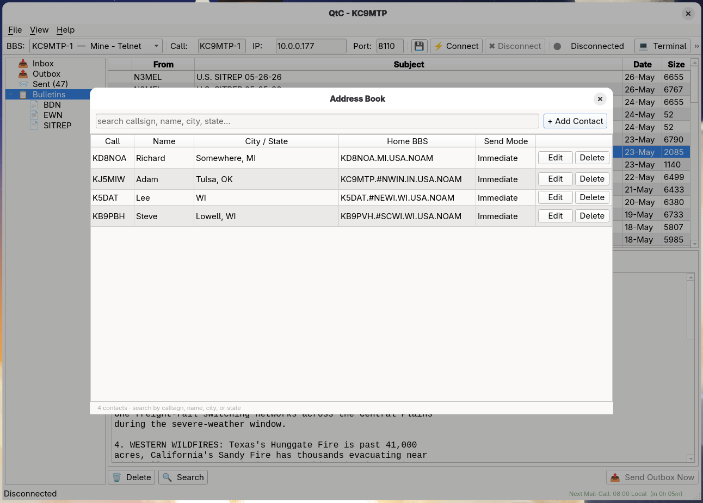

# QtC — BBS Client for Amateur Radio  
**Beta** · Linux · Windows 11 · Raspberry Pi

> *QTC — Q-code for "I have messages for you."*

QtC is a modern desktop BBS client for amateur radio operators.  
It connects to LinBPQ / BPQ32 nodes via **VARA HF**, **VARA FM**, and **Telnet**,  
and handles mail download, bulletin subscriptions, compose, send, address book,  
and a clean three-pane GUI.

Developed by **Bill Johnson KC9MTP** — Valparaiso, Indiana.

---

## Screenshots


*Three-pane inbox — folder tree, message list, and preview pane*


*Bulletins — categorized folder tree (BDN, EWN, SITREP …) with size-aware preview*


*Mail-Call !!! — scheduled unattended Home-BBS sessions (once daily, twice daily, every N hours, or custom times)*


*Settings → BBS List — type-grouped 8-column layout showing VARA HF, VARA FM (NARROW), and Telnet entries side-by-side*


*YAPP file download — pull files from the BBS files area over RF, per the WA7MBL protocol*


*Address Book — hierarchical-address aware contacts, auto-fills in Compose*


*Compose — personal (P) and bulletin (B) types, address-book auto-fill, HA Home-BBS field*

---

## Features

### Transports
- **VARA HF** — RF mail and file transfer with busy-channel detection, PTT keying, and live link stats (bitrate, SN, bandwidth) in the status bar
- **VARA FM** — packet-voice frequencies with **NARROW / WIDE** bandwidth control; same UI as HF
- **Telnet** — LAN / internet nodes for local testing; auto-disconnects after the mail check completes
- **PTT** — RTS or DTR via serial port; defensive flow-control flags for Digirig / CP2105 setups

### Mail
- **Watermark-based check** — first connect pulls a short tail (`LL N`), returning connects pull only new messages (`L watermark-`); only personal mail addressed to your callsign is auto-downloaded — never sysop chatter or system traffic
- **Auto-download** of new personal mail on every connect
- **Compose & reply** — personal (P) and bulletin (B) message types
- **Outbox queue** — stage messages offline, send in one batch when connected, with per-message *send-now* and *@BBS-only* filters
- **Hierarchical addressing (HA)** — full support for routed addresses (e.g. `KC9MTP.#NWIN.IN.USA.NOAM`) in My Station, the address book, and Compose

### Bulletins
- Subscribe by category (SITREP, EWN, WX, BDN, …); browse in the folder tree
- **Selection dialog with size estimates** — prune before pulling over slow RF
- **First-visit backlog management** — only the 2 newest bulletins per category are kept on a new install; skipped bulletins are tombstoned and never reappear
- 120-day tombstone cleanup on every launch

### Mail-Call !!! — scheduled unattended sessions
- Once daily, twice daily, three-times daily, every N hours, or custom times (Local or UTC)
- Auto-connects at slot times — no human in the loop
- Skips selection dialogs, auto-pulls all new bulletins, auto-sends queued outbox
- 2-hour minimum guardrail; refuses to enable until your Home BBS has been visited at least once so the first unattended fire isn't a giant backlog

### YAPP file transfer (RF)
- Pull files from the BBS files area using the WA7MBL YAPP protocol over VARA HF / FM
- Stall-watchdog tuned for weak HF — no premature aborts at 61 bps
- Clean abort path — won't leave the BBS transmitting into the terminal log
- Files saved to `~/.local/share/qtc/downloads/` (Linux) or `%APPDATA%\qtc\downloads\` (Windows)

### Address Book
- HA-aware contact list — callsign, name, city/state, Home BBS, send mode
- Auto-fill in Compose; use-count ranked dropdown
- One-click *+save to address book* link in the Compose dialog

### UI / UX
- Three-pane main window — folder tree, message list, preview pane
- Folder badges — Inbox (N new), Outbox (N), Bulletins (N new)
- **Message search** — real-time filter with scope dropdown and amber highlight in preview
- **Multi-select delete** — Ctrl+click or Shift+click to act on multiple messages or bulletins
- **Mark All Read** — one-click bulk read in the inbox
- **Terminal view** — clean dumb terminal for manual BBS commands, with a YAPP file-download button
- **Debug view** — verbose session log with a *Save Log…* export for capturing RF transfer traces
- **Dark mode** — full Fusion dark palette, toggled in Settings → App
- Adjustable message font with live preview
- Splash screen during launch

### Cross-platform
- Linux, Windows 11, Raspberry Pi OS
- Windows ships as a standalone `.exe` — no Python required

---

## Requirements

- Python 3.10 or newer (3.12 recommended)
- PyQt6
- pyserial (for PTT)
- VARA HF modem (registered or trial) — *run natively on Windows; run under Wine or Crossover on Linux / Pi*
- A VOX or serial PTT interface
- USB Soundcard — Signalink, Rigblaster, Digirig
- A LinBPQ / BPQ32 node to connect to

---

## Installation

### Raspberry Pi 4 / 5 (Raspberry Pi OS Bookworm)

```bash
sudo apt install python3-pyqt6 python3-pyserial
tar -xzf QtC-<version>-beta.tar.gz
cd QtC-<version>-beta
./install.sh
```

If `./install.sh` reports **"Permission denied"** (or `sudo ./install.sh` says **"command not found"**), the script lost its executable bit during the file copy — common when files are transferred via FAT/exFAT USB sticks, `scp` without `-p`, or pasted into a new file in an editor. Restore it with:

```bash
chmod +x install.sh uninstall.sh
./install.sh
```

Once installed, launch QtC from your applications menu or type `qtc` in a terminal.

**Pi notes:**
- VARA HF does not run natively on Pi — most Pi users have the best luck with Pi-Apps and Winetricks
- For a pure Telnet setup (LAN node), no VARA or PTT needed
- PTT serial ports: `/dev/ttyUSB0`, `/dev/ttyACM0`, etc.
- Serial port permission error? Run: `sudo usermod -aG dialout $USER` then log out and back in

---

### Linux (Fedora / Ubuntu / Debian)

```bash
tar -xzf QtC-<version>-beta.tar.gz
cd QtC-<version>-beta
./install.sh
```

If `./install.sh` reports **"Permission denied"** (or `sudo ./install.sh` says **"command not found"**), the script lost its executable bit during the file copy — common when files are transferred via FAT/exFAT USB sticks, `scp` without `-p`, or pasted into a new file in an editor. Restore it with:

```bash
chmod +x install.sh uninstall.sh
./install.sh
```

The installer verifies the five Python source files, regenerates the splash image with `make_splash.py`, installs dependencies, and places a `qtc` launcher in `/usr/local/bin/`. Config and messages are preserved on reinstall.

To run manually without installing:
```bash
pip install -r requirements.txt --break-system-packages
python3 main_window.py
```

Package manager alternatives:
```bash
# Fedora
sudo dnf install python3-pyqt6 python3-pyserial

# Ubuntu / Debian
sudo apt install python3-pyqt6 python3-pyserial
```

---

### Windows 11

QtC ships as a standalone exe — **no Python required**.

#### Step 1 — Download

From the [Releases page](https://github.com/Bill-Johnson/QtC/releases), download
`QtC-<version>-beta-windows.zip`.

#### Step 2 — Extract

Right-click `QtC-<version>-beta-windows.zip` → **Extract All**.
Result: a `QtC\` folder containing `QtC.exe` and supporting files.

#### Step 3 — Run

Double-click **`QtC.exe`** inside the extracted folder.

If Windows shows *"Windows protected your PC"* — click **More info** → **Run anyway**.
This is expected for unsigned executables and only appears once.

**Windows notes:**
- VARA HF must be running before you click Connect in QtC
- Windows Firewall may ask to allow QtC on ports 8300/8301 — click **Allow access**
- PTT serial ports show as `COM3`, `COM4`, etc. — select yours in **Settings → PTT**
- Config and messages are stored in `%APPDATA%\qtc\` and preserved across updates

#### Running from source (advanced)

If you prefer to run from Python directly, `install.ps1` is still included in the
Linux/Mac `.tar.gz` release. Requires Python 3.10+, PyQt6, and pyserial.

---

## First-Time Setup

1. Open **File → Settings → My Station** — enter callsign, name, QTH, and Home BBS
2. Go to the **BBS List** tab — add your BBS with transport (VARA HF or Telnet)
3. Go to the **PTT** tab — select serial port and signal (RTS recommended for Digirig)
4. Go to the **Bulletins** tab — enter category subscriptions (e.g. SITREP, EWN, WX)
5. Close Settings, select your BBS from the dropdown, and click **⚡ Connect**

On your first connection QtC will ask whether to download all personal messages or new only. After that, only new messages (PN) are fetched automatically — keeping sessions short and efficient over slow RF links.

---

## VARA Setup

- VARA HF must be running on the **same machine** as QtC
- VARA command port: **8300** (default)
- VARA data port: **8301** (default)
- Set your callsign in VARA to match the callsign in QtC Settings
- Set VARA's PTT setting to **None** — QtC keys the radio via RTS/DTR directly

---

## Data Storage

| Platform | Path |
|---|---|
| Linux / Pi — database | `~/.local/share/qtc/data/messages.db` |
| Linux / Pi — config | `~/.local/share/qtc/config.json` |
| Windows — database | `%APPDATA%\qtc\data\messages.db` |
| Windows — config | `%APPDATA%\qtc\config.json` |

Both files are preserved when you reinstall or upgrade.

**To force a full bulletin re-download:**
```bash
sqlite3 ~/.local/share/qtc/data/messages.db "DELETE FROM bulletin_tombstones; DELETE FROM bulletins;"
```

---

## Source Files

| File | Purpose |
|---|---|
| `main_window.py` | GUI — PyQt6 main window, toolbar, mail view, terminal, dialogs, Mail-Call scheduler |
| `bbs_session.py` | BBS login, mail check, message download / send, YAPP file transfer |
| `transport.py` | VARA HF, VARA FM, and Telnet transports (single-reader pattern) |
| `ptt.py` | PTT control via serial RTS/DTR |
| `database.py` | SQLite — inbox, outbox, sent, bulletins, watermarks, contacts |
| `make_splash.py` | Pillow generator for `qtc_splash.png` — version-stamped at install/build time |

---

## Known Limitations (Beta)

- No rig control yet — set frequency manually on your radio
- YAPP **upload** not yet implemented (download only)
- YAPP over **Telnet** is unreliable — RF paths (VARA HF / VARA FM) are the supported transport for file transfer
- Direwolf and Soundmodem transports planned for a future release
- Windows exe available as a separate release asset — no Python required (see releases page)
- `install.ps1` remains available for users who prefer running from source

---

## Changelog

### 0.13.2-beta (2026-05-24)
- Added: **Mail-Call auto-downloads bulletins without the selection dialog** — when a Mail-Call slot fires, `_on_bulletin_check` skips `BulletinSelectDialog` and pulls every new bulletin in one batch. The dialog was added so users could prune large bulk pulls over slow VARA, but a station running scheduled Mail-Call slots is already staying current, so the unattended batch is small. Manual Connect flow is unchanged — dialog still appears so the user can prune. Log line `[BULL] Mail-Call session — auto-selecting all N bulletin(s), no dialog.` shows what happened.
- Added: **Mail-Call auto-sends outbox without the "send now?" prompt** — both `_prompt_outbox` and the inline copy in `_on_download_done` skip their `QMessageBox.question` when the session is owned by Mail-Call, and call `_on_send_outbox()` directly. `_on_send_outbox` already honors per-message `send_now` and `at_bbs` filters, so the unattended path inherits the right behavior for free. Log line `[OUTBOX] Mail-Call session — auto-sending N message(s).` shows what was sent.
- Added: **Mail-Call refuses to enable until Home BBS is visited at least once** — `SettingsDialog._mc_on_enable_toggled` now checks `visited_bbs` for any `MYCALL@HOMECALL` key matching the Home BBS base callsign. If none exists, an info dialog explains that the user must Connect from the toolbar once first so QtC learns the mailbox watermark and current bulletin baseline. Prevents Mail-Call's first unattended fire from ingesting the entire mailbox over RF.
- Added: **BBS List table redesigned** with 8 type-grouped columns (`Type | Name | Callsign | Freq | BW | Host | Port | Notes`) — em-dash placeholders show "not applicable" for the inactive transport's cells (Host/Port on VARA rows; Freq/BW on Telnet rows). Sortable headers. Visually unambiguous which fields belong to which transport — no more empty Host cells on VARA entries leaving new packet users confused.
- Added: **VARA FM bandwidth support** — `_BBSEntryDialog` and the main toolbar's BW combo now swap their options based on VARA mode: HF shows `500` / `2300` (kHz), FM shows `NARROW` / `WIDE`. `VaraTransport` takes a `vara_type` kwarg and sends the correct wire command (`BW500` / `BW2300` for HF; bare `NARROW` / `WIDE` for FM). `VaraControl.set_bandwidth` self-detects the wire form from the value so the pre-session BW push also works for FM.
- Fixed: **Address Book dialog opened too narrow** — Home BBS column truncated full hierarchical addresses, Edit/Delete buttons were partially clipped, City/State header showed as "y / Sta". Default size bumped from `560x480` to `880x480` minimum / `960x560` opened. Home BBS column 160→230, Send Mode 90→110, action column 110→140. Full HA addresses like `KC9MTP.#NWIN.IN.USA.NOAM` now display in full without horizontal scrolling.
- Fixed: **Settings → BBS List opened too narrow to show all 8 columns** — BW chopped "NARROW" to "NAR…", Notes header chopped to "Nc", horizontal scrollbar appeared on every open. Settings dialog minimum 640→820, default open size 740→900. BBS table column widths bumped: BW 60→90 (fits NARROW), Host 160→130 (right-sized for IPv4 dotted), Port 58→75 (fits 5-digit), Type/Name/Callsign/Freq nudged for visual balance. Users no longer have to resize on every Settings open.
- Fixed: **FM Bandwidth dropdown clipped "NARROW"** in the BBS Entry dialog and toolbar — both combos widened (dialog 90→120, toolbar 86→110) so the keyword + dropdown arrow render without overlap.
- Fixed: **Connection status banner printed `BWNARROW` / `BWWIDE` for VARA FM** — both `_on_connect` and `_on_connected` branched on `vara_type` and unconditionally prepended `BW` to whatever was in the `bw` field. Now HF prints `BW500`/`BW2300` and FM prints the bare keyword.

### 0.13.1-beta (2026-05-19)
- Fixed: **new-user registration skipped on LinBPQ BBSes that use `>` as the Name-prompt terminator** — `_handle_registration` bailed out whenever the banner ended in `>`, treating it as "already at main BBS prompt." But LinBPQ 6.0.25.16 sends `Please enter your Name\r>` with `>` as the input-waiting indicator (not `:`). New users got dropped to a normal command prompt, then hit `Unknown command` errors when QtC issued `LL 20`. Bail-out check now requires the actual main prompt `de <callsign>>` at the end of the banner, so bare-`>` registration prompts fall through to keyword matching and the Name/QTH/Zip/Home values from My Station settings get auto-sent. Reported 2026-05-19 by Bill testing K2ROG → KC9MTP-1 over VARA HF.
- Fixed: **ghost lines, leading-character drops, and duplicate output in Terminal View** — both transports had two threads independently calling `recv()` on the same socket (the background streamer and the foreground `_expect()`). Whichever won got the bytes the other couldn't see, producing all three symptoms: duplicate banners (streamer logs each RF frame, then `_expect` logs the assembled response), fragments like `stcode using qth and zip commands.` with the `Po` prefix missing (`_expect`'s `recv()` swallowed those bytes before the streamer saw them), and mid-line breaks across PTT turnarounds (streamer's 0.5 s timeout flushed partial lines). Rewrote both transports as **single-reader**: one reader thread owns `recv()` on the data socket and the rest of the code (`read_until`, `read_raw_bytes`, `flush_input`) consumes from a shared lock-protected buffer. `_expect()` no longer double-logs while terminal mode is on. Line-emission now flushes only on real terminators (`\r`, `\n`, `>`, `:`, `?`), so an RF-frame split inside a line is reassembled instead of printed in pieces.

### 0.12.1-beta (2026-05-15)
- Fixed: **YAPP downloads bailing mid-file on weak HF** — the per-block read used a fixed 20 s timeout, structurally too short at 61 bps (a 234-byte block needs ~30 s pure transmit time before ARQ retries). Replaced with a stall-watchdog that keeps reading as long as bytes are arriving and gives up only after 30 s of true silence (hard ceiling 300 s/block). Reported by Adam KJ5MIW on 2026-05-12 pulling `BDN_Short_Center.mdf`.
- Fixed: **YAPP abort left BBS transmitting the rest of the file into the terminal log** — when the receiver gave up mid-transfer, it raised `IOError` without telling the sender. The BBS kept transmitting; the remaining file bytes appeared as `[RX]` text once terminal mode re-engaged. Receiver now sends `CN` (Cancel — proper `[CAN][len][reason]` form per WA7MBL RFC v1.1) and drains the wire to silence before re-raising, so the BBS prompt arrives cleanly.
- Fixed: **New-user registration sent bare values to LinBPQ** — `QTH`, `ZIP`, and `HOME` are dual-purpose commands in the BPQ user database (bare = query the stored value, with arg = set it). QtC was sending raw values like `Valparaiso, IN`, which BPQ rejected as unknown commands. Registration now sends the prefixed form (`QTH Valparaiso, IN`, `ZIP 46383`, `HOME KC9MTP`); the name prompt remains a bare value.
- Fixed: **PTT silently failed to open the serial port** — `PTTController.open()` swallowed `serial.Serial` exceptions and left `_ser = None`, and neither *Test PTT* nor the connect path checked whether the open had actually succeeded. Users would watch the waterfall transmit with no PTT keying and no error. Added `PTTController.is_open` and `last_error`; both call sites now surface the underlying exception (`QMessageBox` for Test PTT, `[PTT] ***` log line + error signal for the connect path) with the hint "this port may be open in Vara Terminal or another app — close it and reconnect." Reported by Adam KJ5MIW on 2026-05-14 (Panasonic FZ-G1 + Digirig CP2105).
- Changed: **PTT settings dialog hint** — now explicitly warns that only one program can hold the serial port at a time, and that on CP2105 dual-port devices (some Digirig models) PTT is on the *Standard* port, not the *Enhanced* port.
- Changed: **Defensive pyserial flags** — `PTTController.open()` now passes `rtscts=False, dsrdtr=False, xonxoff=False` so pyserial doesn't auto-toggle RTS/DTR as flow control on driver versions that do so by default.

### 0.12.0-beta (2026-05-07)
- Added: **Splash screen** — shown both by the PyInstaller bootloader (visible immediately on Windows .exe launch, before Python loads) and by an in-Python `QSplashScreen` while `MainWindow` constructs. Together these cover the slow first-run launch on Windows. Splash image (`qtc_splash.png`) is generated from scratch by a new `make_splash.py` Pillow script that reads `APP_VERSION` so the version line always matches the installed release.
- Added: **Save Log…** button in the Debug view — writes the verbose session monitor buffer to a plain-text `.log` file via a save dialog. Useful for capturing RF transfer traces.
- Changed: terminal "Get File" button relabeled to **"📁 File Download - YAPP"** and widened to make the function obvious to both old-school and new amateur radio operators (YAPP has been the BBS file-transfer standard since Jeff Jacobsen WA7MBL published the RFC in 1986).
- Fixed: YAPP file download left LinBPQ stuck in transfer mode — file saved correctly but the next user command was rejected with `Unexpected message during YAPP Transfer. Transfer cancelled`. Root cause: LinBPQ ends a YAPP session by sending a second SOH header with the same filename and `size=0` as a YAPP-C batch end-of-session sentinel, not `[EOT]` as the prior implementation expected. `YappReceiver` now parses that sentinel and replies with `NAK` (0x15), releasing the BBS cleanly so subsequent commands work.
- Fixed: BBS prompt `de KC9MTP>` not shown in the terminal view after a successful YAPP download — `read_until(">")` in `download_file()`'s finally block consumed the prompt for protocol cleanup without re-emitting it; the prompt is now logged as `[RX]` so it appears in the terminal view the same way as after any other command.

### 0.10.10-beta (2026-04-14)
- Fixed: messages lost between sessions when running as exe — `data_dir` relative path resolved against working directory instead of `%APPDATA%\qtc`; now always anchored to `_APP_DIR`

### 0.10.9-beta (2026-04-14)
- Windows exe release — PyInstaller one-folder build; no Python required on target machine
- Fixed: app icon not found when running as frozen exe — `sys.frozen` guard replaces `__file__`-based icon path lookup

### 0.10.8-beta (2026-03-28)
- Fixed: outbox send cancelled immediately — LinBPQ splits `Enter Title (only):` across two TCP packets (`Enter` arrives first, `Title (only):` arrives in the next packet); the previous fix matched on `"nter "` which fired on the first packet before `"Title"` arrived, hit the failure branch, and sent a bare Enter cancelling the message; fixed by waiting for `"itle"` which only matches once the second packet with the full title prompt has arrived; simplified `send_message` to always expect title-then-body (LinBPQ always follows this sequence for `SP CALL`)

### 0.10.7-beta (2026-03-28)
- Fixed: outbox send failed silently — terminal monitor thread was consuming BBS prompts (`Enter Title (only):`, `Enter Message Text...`) before `send_message` could read them; fixed by pausing the monitor in `_run_send` before calling `send_message`, matching the pattern used by all other BBS I/O paths
- Fixed: second queued message sent into wrong BBS state when first send failed mid-compose — `send_message` now sends a bare Enter (cancels at title prompt) before returning False, restoring the BBS to the `>` prompt
- Fixed: `send_message` now handles both LinBPQ prompt styles: `Enter Title (only):` (BBS knows recipient home BBS) and `Enter Message Text...` (no home BBS); both are caught by waiting for `"nter "` and branching on content

### 0.10.6-beta (2026-03-28)
- Fixed: outbox send hung at "Enter Title (only):" — `send_message` was waiting for bare `":"` which matched too early on the `Address @HOMEBBS added from HomeBBS` line LinBPQ emits before the title prompt; now waits for `"itle"` (matches both `"Title"` and `"Enter Title"`) to ensure the correct prompt is consumed before sending the subject
- Fixed: `_expect("Enter Message")` was case-sensitive; LinBPQ sends lowercase `"Enter message"`; changed to match `"nter message"` (case-insensitive substring)

### 0.10.5-beta (2026-03-28)
- Fixed: bulletin dialog never appeared on first connect — `_process_ll_bulletins` called `self.sig_log.emit()` but `sig_log` lives on the worker, not the main window; the silent `AttributeError` aborted the function before the dialog could show; fixed by using `self.worker.sig_log.emit()`
- Fixed: spurious `[BULL] No new bulletins.` on returning connects when no mail was found — the bulletin check was firing regardless of whether `check_on_connect` was enabled or subscriptions were configured
- First connect via Telnet now uses `LL 50` (was `LL 20`); VARA remains `LL 20`

### 0.10.4-beta (2026-03-28)
- Bulletin check on connect no longer sends `L> CATEGORY` for each subscription — bulletins are now extracted directly from the `LL N` / `L watermark-` scan already performed on connect; `sig_ll_ready` now carries the filtered bulletin list alongside the personal mail lists; `_process_ll_bulletins()` applies tombstone/exists filtering and feeds the existing selection dialog; `L>` is still used for the manual mid-session Refresh path where the scan data is stale

### 0.10.3-beta (2026-03-28)
- Fixed: message download hang/scramble when downloading via the new LL/L watermark path — `_run_download` was not pausing the terminal monitor thread before calling `download_message`, causing a race condition where both threads read from the same socket simultaneously; fixed by adding `set_terminal_mode(False)` / `flush_input()` guard around the download loop in `_run_download`, matching the pattern used by `_run_check_bulletins` and `_run_mail_check`
- Reverted: spurious post-read flush added in 0.10.2 — it treated the symptom rather than the root cause

### 0.10.2-beta (2026-03-28)
- Fixed: message download hang on messages with quoted/forwarded content — LinBPQ delivers trailing buffered data after `[End of Message]` and the BBS prompt in the same TCP burst; `read_until` returned on the prompt match but left that data in the buffer, poisoning the next `_expect`; fixed by flushing the buffer after each message download

### 0.10.1-beta (2026-03-28)
- Fixed: "No new personal mail" shown incorrectly when choosing PN+PY on first connect — personal mail lists were set on the worker thread object but read from the main window object; replaced shared attributes with `sig_ll_ready` signal for safe cross-thread delivery
- Fixed: Telnet auto-disconnect not firing after mail check — "no new mail" paths in `_on_first_visit` were not calling `_prompt_outbox()`
- Fixed: Bulletins not checked on returning connect with no new personal mail — returning-visit "no mail" branch now triggers bulletin check before `_prompt_outbox()`, mirroring `_on_mail_summary` logic

### 0.10.0-beta (2026-03-28)
- Watermark-based mail check — replaces `LM` with `LL N` on first connect and `L watermark-` on subsequent connects; only personal mail addressed to mycall (type P, status N) is auto-downloaded; skips `PF`, `PY`, `TO=SYSOP`, `FROM=SYSTEM`
- `bbs_watermarks` table added to database; tracks highest seen message number per callsign/BBS pair; migrates automatically on first run
- Bulletin filter updated to accept `BN` (status N) and `B$` (forwarded, status $) — was previously limited to status N only

### 0.9.11-beta (2026-03-25)
- Fixed: Telnet login on non-standard LinBPQ nodes — QtC now drains all trailing node status lines after sending the `bbs` command before declaring login complete, and properly detects both `de N0CALL>` and plain `>` BBS prompt styles; resolves mail retrieval failure on multi-hop nodes where circuit status lines arrive after the initial prompt

### 0.9.10-beta (2026-03-24)
- Fixed: Windows `install.ps1` version header check failing on machines where PowerShell reads UTF-8 files with em-dash characters as mojibake — header check now uses Python to read the first line, bypassing PowerShell encoding issues

### 0.9.9-beta (2026-03-24)
- Bulletin first-connect backlog management — on first visit to a BBS, all but the 2 newest bulletins per category are auto-tombstoned; no more giant download backlog on a new install
- Bulletins skipped in the selection dialog are tombstoned immediately and will not reappear on future connects
- My Station → Home BBS hint updated to hierarchical address format (e.g. `K5DAT.#NEWI.WI.USA.NOAM`)
- README header changed from versioned to **Beta** — version is now tracked on the GitHub Releases page only

### 0.9.8-beta (2026-03-22)
- Fixed: Windows installer fails to detect Python when installed via the Python Launcher (`py.exe`) — `install.ps1` now tries `py` first, then falls back to `python`; fixes Python 3.11+ installs that do not add `python` to PATH

### 0.9.7-beta (2026-03-22)
- Multi-select delete — Ctrl+click or Shift+click to select multiple messages or bulletins; Delete button shows count; confirm dialog names quantity and type

### 0.9.6-beta (2026-03-21)
- Fixed: Telnet Terminal View frozen after login — added background reader thread to TelnetTransport
- Fixed: Telnet Mail View not downloading messages — terminal monitor was consuming socket data during download
- Fixed: Toolbar status text hard-clipped — now elides with … at 480px
- Telnet auto-disconnect — Mail View sessions disconnect cleanly after downloads and outbox complete

### 0.9.5-beta (2026-03-18)
- Fixed: Message download body bleeding — two-stage read waits for `[End of Message]` before BBS prompt; fixes false matches on `>` in forwarding headers (VARA and Telnet)
- Fixed: BBS List edit crash — `_BBSEntryDialog` missing `_note_color`
- Fixed: Telnet `flush_input` crash
- Bulletin tombstone 120-day cleanup on every launch

### 0.9.4-beta (2026-03-17)
- Bulletin support — subscribe to categories, browse in folder panel, selection dialog with size estimates
- Search highlight — amber highlight on matched terms in message preview

### 0.9.3-beta (2026-03-17)
- Message search — real-time filter with scope dropdown
- Dark mode and font size in Settings → App
- Fixed: VARA reconnect after BBS idle timeout

### 0.9.1-beta
- Fixed: Windows crash on missing or corrupt config.json
- GPL-3 headers, qtc_icon.ico for Windows

### 0.9.0-beta (2026-03-16)
- Fixed: VARA Error 111 on reconnect
- Mark All Read, VARA link stats, inbox column widths

---

*73 de KC9MTP — Bill Johnson — Valparaiso, IN*  
*GPL-3 — https://github.com/Bill-Johnson/QtC*
