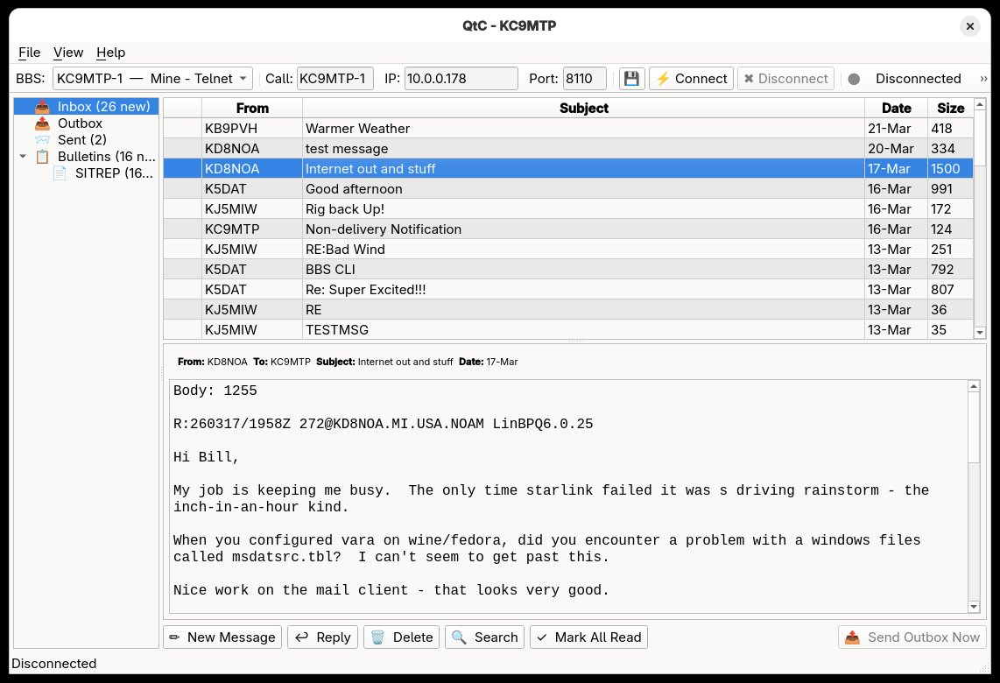
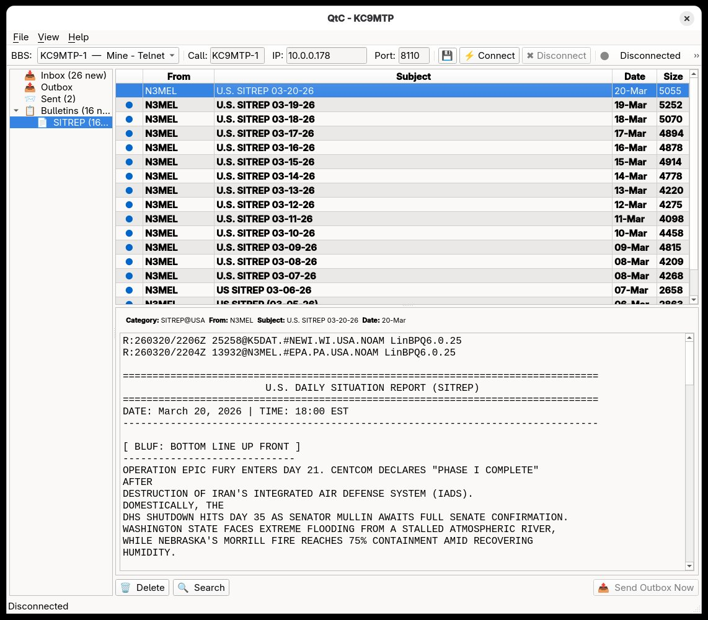
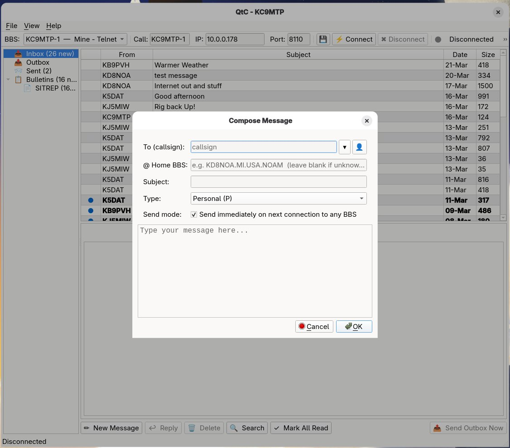
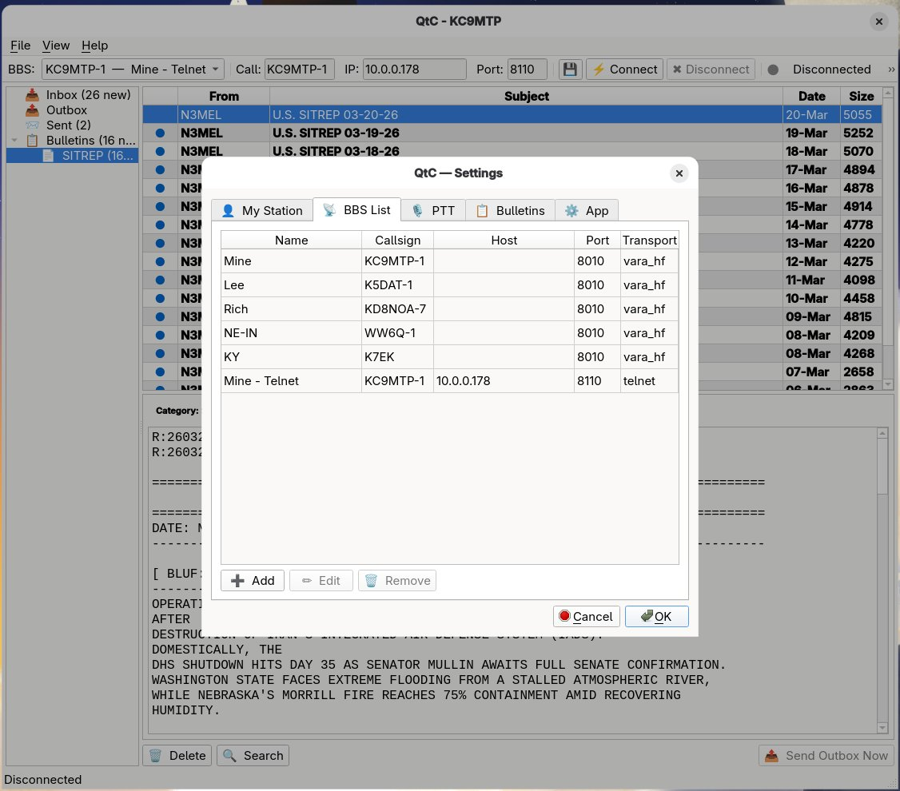

# QtC — BBS Client for Amateur Radio  
**v0.9.7-beta** · Linux · Windows 11 · Raspberry Pi

> *QTC — Q-code for "I have messages for you."*

QtC is a modern desktop BBS client for amateur radio operators.  
It connects to LinBPQ / BPQ32 nodes via **VARA HF**, **VARA FM**, and **Telnet**,  
and handles mail download, bulletin subscriptions, compose, send, address book,  
and a clean three-pane GUI.

Developed by **Bill Johnson KC9MTP** — Valparaiso, Indiana.

---

## Screenshots


*Three-pane inbox — folder tree, message list, and preview pane*


*Bulletin view — SITREP category with full message preview*


*Compose window — personal and bulletin message types, address book auto-fill*


*Settings — BBS List tab showing VARA HF and Telnet entries*

---

## Features

- **VARA HF / VARA FM** — RF connect with busy-channel detection and PTT control
- **Telnet** — for local testing and LAN-connected nodes; auto-disconnects after mail check
- **Mail check** — `LM` with new-only (PN) or full (PN+PY) options
- **Auto-download** — new personal mail downloads automatically on connect
- **Bulletins** — subscribe to categories (SITREP, EWN, WX, etc.); browse in folder panel
- **Compose & reply** — personal (P) and bulletin (B) message types
- **Outbox queue** — stage messages, send in one batch when connected
- **Address book** — auto-fill in compose, use-count ranked dropdown
- **Multi-select delete** — Ctrl+click or Shift+click to select and delete multiple messages
- **Message search** — real-time filter with scope dropdown and amber highlight in preview
- **Progress tracking** — download and send progress in toolbar and status bar
- **VARA link stats** — live bitrate, SN, and bandwidth in status bar
- **Terminal view** — clean dumb terminal for manual BBS commands
- **Debug view** — verbose session log for troubleshooting
- **Folder badges** — Inbox (N new), Outbox (N), Bulletins (N new)
- **Mark all read** — one-click bulk read in inbox
- **Dark mode** — full Fusion dark palette, toggled in Settings → App
- **Font size** — adjustable message font with live preview
- **PTT control** — RTS or DTR via serial port
- **Cross-platform** — Linux, Windows 11, Raspberry Pi OS

---

## Requirements

- Python 3.10 or newer (3.12 recommended)
- PyQt6
- pyserial (for PTT)
- VARA HF modem (registered or trial) — *run natively on Windows; run under Wine or Crossover on Linux / Pi*
- A VOX or serial PTT interface
- USB Soundcard — Signalink, Rigblaster, Digirig
- A LinBPQ / BPQ32 node to connect to

---

## Installation

### Raspberry Pi 4 / 5 (Raspberry Pi OS Bookworm)

```bash
sudo apt install python3-pyqt6 python3-pyserial
tar -xzf QtC-0.9.7-beta.tar.gz
cd QtC-0.9.7-beta
./install.sh
```

Once installed, launch QtC from your applications menu or type `qtc` in a terminal.

**Pi notes:**
- VARA HF does not run natively on Pi — most Pi users have the best luck with Pi-Apps and Winetricks
- For a pure Telnet setup (LAN node), no VARA or PTT needed
- PTT serial ports: `/dev/ttyUSB0`, `/dev/ttyACM0`, etc.
- Serial port permission error? Run: `sudo usermod -aG dialout $USER` then log out and back in

---

### Linux (Fedora / Ubuntu / Debian)

```bash
tar -xzf QtC-0.9.7-beta.tar.gz
cd QtC-0.9.7-beta
./install.sh
```

The installer checks all five source files, installs dependencies, and places a `qtc` launcher in `/usr/local/bin/`. Config and messages are preserved on reinstall.

To run manually without installing:
```bash
pip install -r requirements.txt --break-system-packages
python3 main_window.py
```

Package manager alternatives:
```bash
# Fedora
sudo dnf install python3-pyqt6 python3-pyserial

# Ubuntu / Debian
sudo apt install python3-pyqt6 python3-pyserial
```

---

### Windows 11

QtC installs itself — you just need Python on your computer first, then run the installer script once. After that a **QtC shortcut appears on your Desktop**.

#### Step 1 — Install Python (one time only)

1. Go to: **https://www.python.org/downloads/**
2. Click the big **"Download Python 3.x.x"** button
3. Run the installer — **check "Add Python to PATH"** before clicking Install Now
4. Click **Install Now** and let it finish

To verify: press **Win+R**, type `cmd`, press Enter, type `python --version`.

#### Step 2 — Extract the QtC files

1. Right-click `QtC-0.9.7-beta.tar.gz` → **Extract All**
2. You may need to extract twice — `.tar.gz` → `.tar` → folder
3. Result: a folder called `QtC-0.9.7-beta` containing `.py` files

**Or use 7-Zip** (free): https://www.7-zip.org/

#### Step 3 — Run the installer

1. Open the `QtC-0.9.7-beta` folder
2. Hold **Shift** + right-click **`install.ps1`** → **"Run with PowerShell"**
3. If Windows shows *"Windows protected your PC"* — click **"Run anyway"**
4. If you see *"scripts is disabled"* — open PowerShell as administrator and run:
   ```
   Set-ExecutionPolicy -Scope CurrentUser RemoteSigned
   ```
5. When it says **"QtC installed successfully!"** press Enter to close

#### Step 4 — Run QtC

Double-click the **QtC** shortcut on your Desktop.

**Windows notes:**
- VARA HF must be running before you click Connect in QtC
- Windows Firewall may ask to allow QtC on ports 8300/8301 — click **Allow access**
- PTT serial ports show as `COM3`, `COM4`, etc. — select yours in **Settings → PTT**

---

## First-Time Setup

1. Open **File → Settings → My Station** — enter callsign, name, QTH, and Home BBS
2. Go to the **BBS List** tab — add your BBS with transport (VARA HF or Telnet)
3. Go to the **PTT** tab — select serial port and signal (RTS recommended for Digirig)
4. Go to the **Bulletins** tab — enter category subscriptions (e.g. SITREP, EWN, WX)
5. Close Settings, select your BBS from the dropdown, and click **⚡ Connect**

On your first connection QtC will ask whether to download all personal messages or new only. After that, only new messages (PN) are fetched automatically — keeping sessions short and efficient over slow RF links.

---

## VARA Setup

- VARA HF must be running on the **same machine** as QtC
- VARA command port: **8300** (default)
- VARA data port: **8301** (default)
- Set your callsign in VARA to match the callsign in QtC Settings
- Set VARA's PTT setting to **None** — QtC keys the radio via RTS/DTR directly

---

## Data Storage

| Platform | Path |
|---|---|
| Linux / Pi — database | `~/.local/share/qtc/data/messages.db` |
| Linux / Pi — config | `~/.local/share/qtc/config.json` |
| Windows — database | `%APPDATA%\qtc\data\messages.db` |
| Windows — config | `%APPDATA%\qtc\config.json` |

Both files are preserved when you reinstall or upgrade.

**To force a full bulletin re-download:**
```bash
sqlite3 ~/.local/share/qtc/data/messages.db "DELETE FROM bulletin_tombstones; DELETE FROM bulletins;"
```

---

## Source Files

| File | Purpose |
|---|---|
| `main_window.py` | GUI — PyQt6 main window, toolbar, mail view, terminal, dialogs |
| `bbs_session.py` | BBS login, mail check, message download and send |
| `transport.py` | VARA HF, VARA FM, and Telnet transports |
| `ptt.py` | PTT control via serial RTS/DTR |
| `database.py` | SQLite inbox/outbox/sent/bulletins/contacts |

---

## Known Limitations (Beta)

- No rig control yet — set frequency manually on your radio
- VARA FM support in code but not yet field tested
- Direwolf and Soundmodem transports planned for a future release
- Windows NSIS clickable installer planned — currently uses PowerShell script

---

## Changelog

### 0.9.7-beta (2026-03-22)
- Multi-select delete — Ctrl+click or Shift+click to select multiple messages or bulletins; Delete button shows count; confirm dialog names quantity and type

### 0.9.6-beta (2026-03-21)
- Fixed: Telnet Terminal View frozen after login — added background reader thread to TelnetTransport
- Fixed: Telnet Mail View not downloading messages — terminal monitor was consuming socket data during download
- Fixed: Toolbar status text hard-clipped — now elides with … at 480px
- Telnet auto-disconnect — Mail View sessions disconnect cleanly after downloads and outbox complete

### 0.9.5-beta (2026-03-18)
- Fixed: Message download body bleeding — two-stage read waits for `[End of Message]` before BBS prompt; fixes false matches on `>` in forwarding headers (VARA and Telnet)
- Fixed: BBS List edit crash — `_BBSEntryDialog` missing `_note_color`
- Fixed: Telnet `flush_input` crash
- Bulletin tombstone 120-day cleanup on every launch

### 0.9.4-beta (2026-03-17)
- Bulletin support — subscribe to categories, browse in folder panel, selection dialog with size estimates
- Search highlight — amber highlight on matched terms in message preview

### 0.9.3-beta (2026-03-17)
- Message search — real-time filter with scope dropdown
- Dark mode and font size in Settings → App
- Fixed: VARA reconnect after BBS idle timeout

### 0.9.1-beta
- Fixed: Windows crash on missing or corrupt config.json
- GPL-3 headers, qtc_icon.ico for Windows

### 0.9.0-beta (2026-03-16)
- Fixed: VARA Error 111 on reconnect
- Mark All Read, VARA link stats, inbox column widths

---

*73 de KC9MTP — Bill Johnson — Valparaiso, IN*  
*GPL-3 — https://github.com/Bill-Johnson/QtC*
