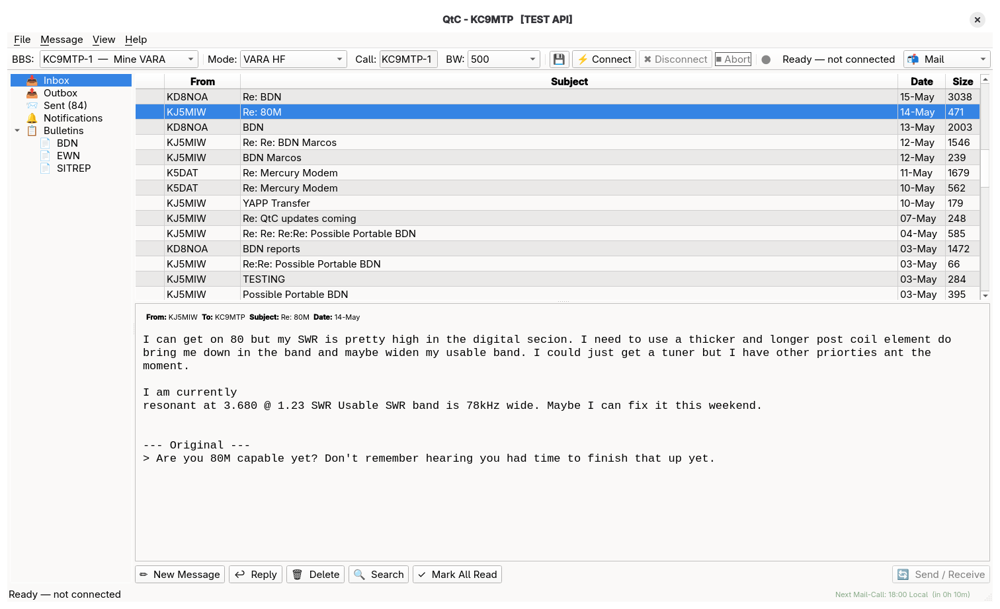
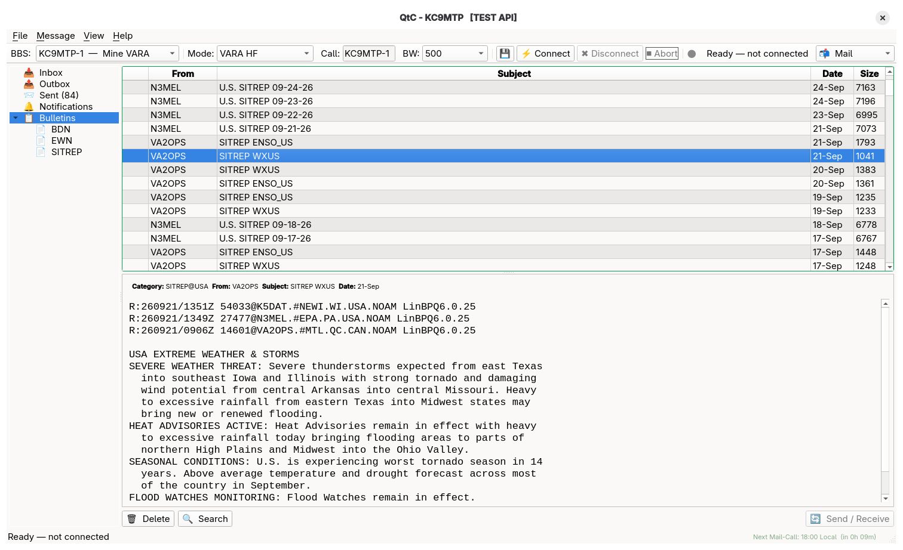
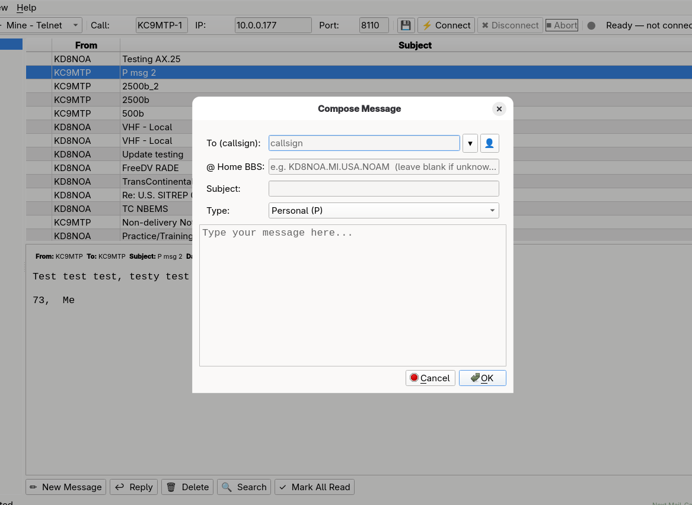
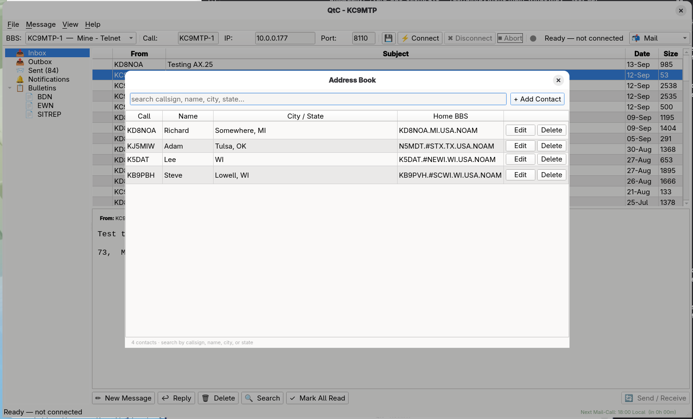
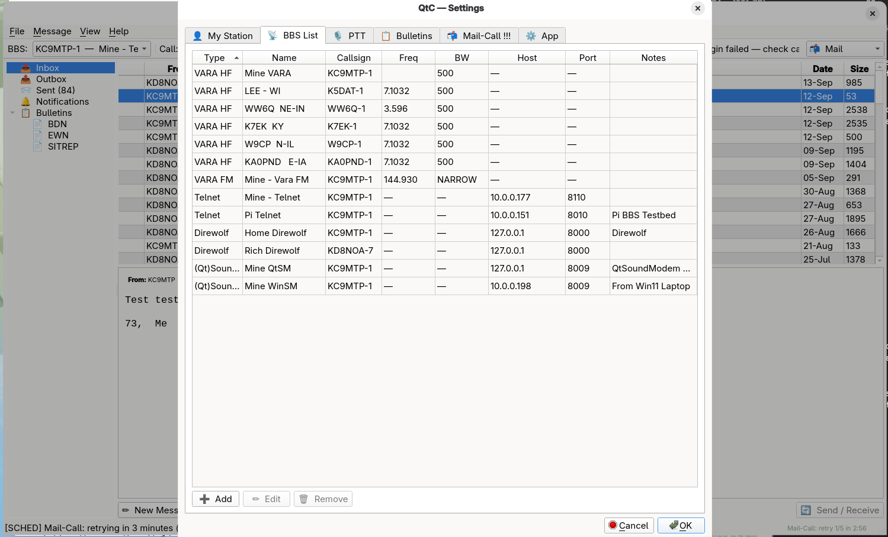
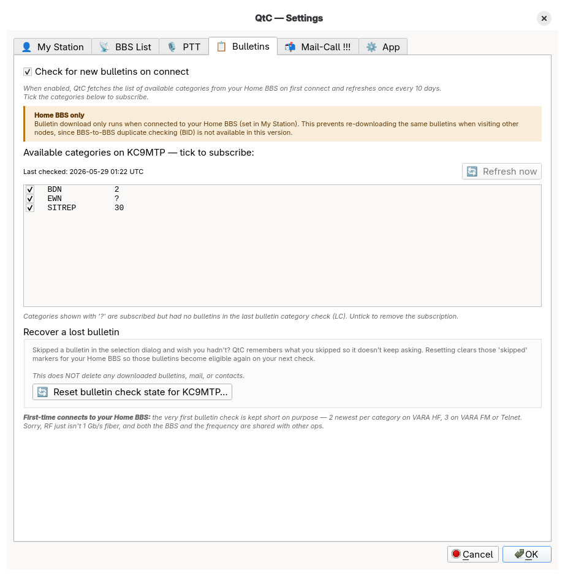
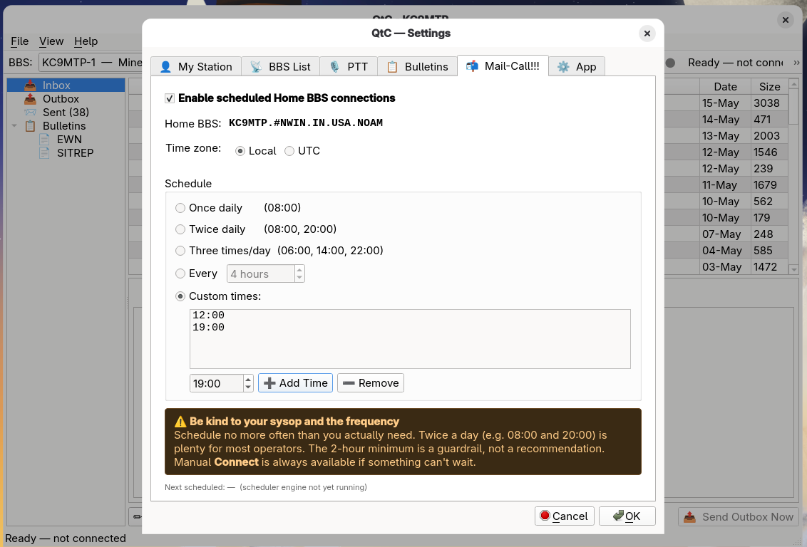
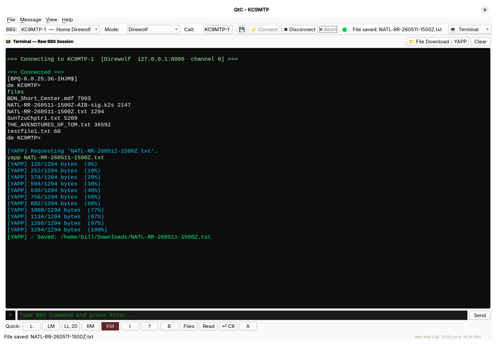
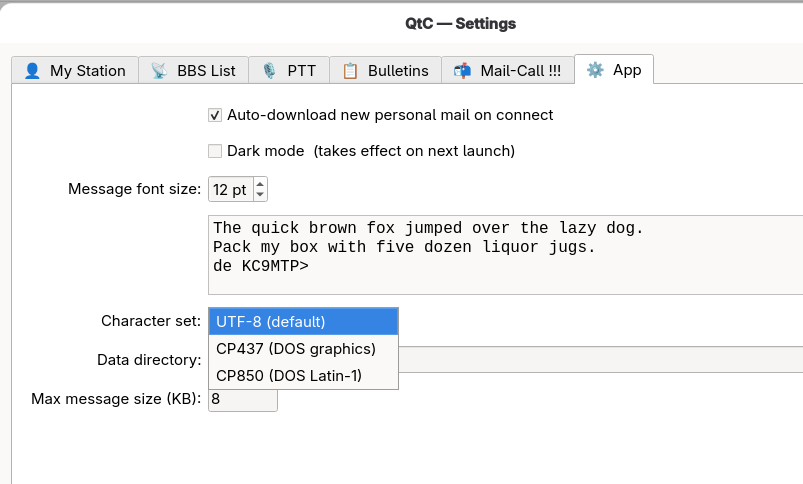
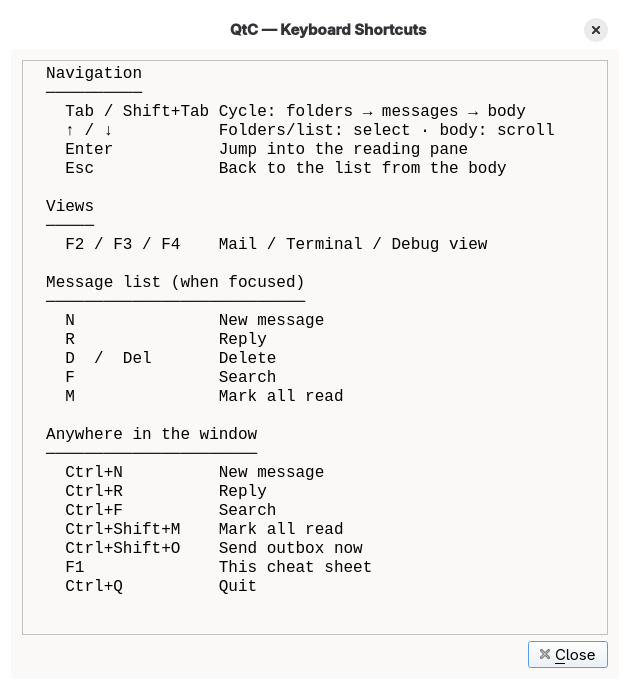

# QtC — BBS Client for Amateur Radio  
**Beta** · Linux · Windows 11 · Raspberry Pi

> *QTC — Q-code for "I have messages for you."*

QtC is a modern desktop BBS client for amateur radio operators.  
It connects to LinBPQ / BPQ32 nodes via **VARA HF**, **VARA FM**, **AX.25 packet**  
(through Direwolf or UZ7HO SoundModem / QtSoundModem), and **Telnet**, and handles  
mail download, bulletin subscriptions, compose, send, address book, and a clean  
three-pane GUI.

Developed by **Bill Johnson KC9MTP** — Valparaiso, Indiana.

---

## Screenshots


*Three-pane inbox — folder tree, message list, and preview pane; the toolbar carries the BBS, Mode, Abort and the View dropdown*


*Bulletins — categorized folder tree (BDN, EWN, SITREP …) with size-aware preview*


*Compose — personal (P) and bulletin (B) types, address-book auto-fill, HA Home-BBS field*


*Address Book — hierarchical-address aware contacts, auto-fills in Compose*


*Settings → BBS List — VARA HF, VARA FM, Telnet, Direwolf and (Qt)SoundModem entries, grouped by type*


*Settings → Bulletins — pull the live category list off the BBS (📡 Get categories from BBS…) and check the ones you want*


*Mail-Call !!! — scheduled unattended Home-BBS sessions (once daily, twice daily, every N hours, or custom times)*


*YAPP file download over AX.25 packet through Direwolf — pull files from the BBS files area, per the WA7MBL protocol*


*Settings → App — pick the text codec (UTF-8, CP437, or CP850) so DOS box-drawing bulletins render correctly*


*Help → Keyboard Shortcuts (F1) — drive QtC entirely from the keyboard*

---

## Features

### Transports
- **VARA HF** — RF mail and file transfer with busy-channel detection, PTT keying, and live link stats (bitrate, SN, bandwidth) in the status bar
- **VARA FM** — packet-voice frequencies with **NARROW / WIDE** bandwidth control; same UI as HF
- **AX.25 packet** — 300 baud HF and 1200 baud VHF through **Direwolf** or **UZ7HO SoundModem / QtSoundModem**, using the modem's AGW port. The modem can run on another computer on your network (many operators keep SoundModem on a separate Windows PC) — set its address in the BBS entry
- **Telnet** — LAN / internet nodes for local testing; auto-disconnects after the mail check completes
- **PTT** — for VARA, RTS or DTR via serial port, with both lines set low before QtC opens the port, so opening it does not key the radio; defensive flow-control flags for Digirig / CP2105 setups. Packet modems key the radio themselves

### Mail
- **Bounded mail check** — every listing is limited by something you control, never by how busy the BBS is: `LM` lists your own mailbox, `L> CATEGORY` lists one page of each bulletin category you subscribe to, and `OP` sets the BBS page length (20 by default) so a long listing pauses instead of streaming. Only personal mail addressed to your callsign is auto-downloaded — never sysop chatter or system traffic
- **Auto-download** of new personal mail when you connect from Mail view. Connecting from Terminal or Debug view logs in and stops there — you drive
- **Compose & reply** — personal (P) and bulletin (B) message types
- **Outbox queue** — stage messages offline; everything queued goes out together on your next **Send / Receive**, with each message's size shown in the list
- **Hierarchical addressing (HA)** — full support for routed addresses (e.g. `N0CALL.#REGION.ST.USA.NOAM`) in My Station, the address book, and Compose

### Bulletins
- Subscribe by category (SITREP, EWN, WX, BDN, …); browse in the folder tree
- **Pull the category list off the BBS** — *📡 Get categories from BBS…* runs the node's `LC` command and shows every category it carries, with message counts, as a checkable list; pick subscriptions from what the BBS actually offers instead of typing names blind
- **New-category alerts** — QtC remembers the known category set and drops a 🔔 Notifications entry whenever a brand-new category appears on your BBS
- **Selection dialog with size estimates** — prune before pulling over slow RF
- **First-visit backlog management** — only the newest few bulletins per category are kept on a new install (2 on VARA HF and packet, 3 on the roomier VARA FM / Telnet paths); skipped bulletins are tombstoned and never reappear
- 120-day tombstone cleanup on every launch

### Notifications
- **🔔 Notifications folder** — QtC-generated alerts (such as a new bulletin category) land in their own folder instead of mixing into your Inbox
- Real radio mail and app notifications are counted and marked-read separately, so an app alert never inflates your unread-mail badge

### Mail-Call !!! — scheduled unattended sessions
- Once daily, twice daily, three-times daily, every N hours, or custom times (Local or UTC)
- Auto-connects at slot times — no human in the loop
- Skips selection dialogs, auto-pulls all new bulletins, auto-sends queued outbox
- 2-hour minimum guardrail; refuses to enable until your Home BBS has been visited at least once so the first unattended fire isn't a giant backlog
- Over RF, an acceptance dialog spells out what running a radio on a timer means. **Check §97.221 before you enable it** — unattended automatic operation is limited to certain segments, and QtC cannot see your dial frequency, so verifying it is yours to do

### YAPP file transfer (RF)
- Pull files from the BBS files area using the WA7MBL YAPP protocol over VARA HF / FM and AX.25 packet
- Stall-watchdog tuned for weak HF — no premature aborts at 61 bps
- A file download cannot be stopped once it starts — the BBS has already committed the whole file to the link — so over RF QtC asks before the radio keys
- Files saved to `~/.local/share/qtc/downloads/` (Linux) or `%APPDATA%\qtc\downloads\` (Windows) by default

### Address Book
- HA-aware contact list — callsign, name, city/state, Home BBS
- Auto-fill in Compose; use-count ranked dropdown
- One-click *+save to address book* link in the Compose dialog

### UI / UX
- Three-pane main window — folder tree, message list, preview pane
- Folder badges — Inbox (N new), Outbox (N), Bulletins (N new), Notifications (N new)
- **Keyboard-driven navigation** — Tab/Shift+Tab cycles folders → message list → reading pane; Enter opens the body, Esc returns to the list; F2/F3/F4 switch Mail/Terminal/Debug; single-key list actions (N new, R reply, D/Del delete, F search, M mark-all-read) plus Ctrl shortcuts that work anywhere. **Help → Keyboard Shortcuts (F1)** shows the full cheat sheet
- **Character-set selector** — decode BBS content as UTF-8 (default), CP437 (DOS graphics), or CP850 (DOS Latin-1) in Settings → App, so box-drawing / line-art bulletins render correctly
- **⏹ Abort button** — stop a mail or bulletin download that QtC is running and return the BBS to its command prompt with the BBS's own `A` command. You stay connected. It is greyed out during a YAPP file transfer, which cannot be stopped, and in Terminal view, where the **A** quick button does the same job
- **View dropdown** — switch between Mail, Terminal and Debug from the toolbar, or with F2 / F3 / F4
- **Message search** — real-time filter with scope dropdown and amber highlight in preview
- **Multi-select delete** — Ctrl+click or Shift+click to act on multiple messages or bulletins
- **Mark All Read** — one-click bulk read in the inbox
- **Terminal view** — clean dumb terminal for manual BBS commands, with a YAPP file-download button and quick buttons for the common commands. Enter on an empty line sends a bare carriage return, which is how you answer the BBS's page prompt when a listing stops at the OP limit
- **Debug view** — verbose session log with a *Save Log…* export for capturing RF transfer traces. The log is only written when you save it, so save before you close QtC
- **Dark mode** — full Fusion dark palette, toggled in Settings → App
- Adjustable message font with live preview
- Splash screen during launch

### Cross-platform
- Linux, Windows 11, Raspberry Pi OS
- Windows ships as a standalone `.exe` — no Python required

---

## Requirements

- Python 3.10 or newer (3.12 recommended)
- PyQt6
- pyserial (for PTT)
- For VARA: the VARA HF and/or VARA FM modem (registered or trial) — *run natively on Windows; run under Wine or Crossover on Linux / Pi* — and a VOX or serial PTT interface
- For packet: Direwolf, UZ7HO SoundModem (Windows) or QtSoundModem (Linux / Pi)
- USB Soundcard — Signalink, Rigblaster, Digirig
- A LinBPQ / BPQ32 node to connect to

---

## Installation

### Raspberry Pi 4 / 5 (Raspberry Pi OS Bookworm)

```bash
sudo apt install python3-pyqt6 python3-pyserial
tar -xzf QtC-<version>-beta.tar.gz
cd QtC-<version>-beta
./install.sh
```

If `./install.sh` reports **"Permission denied"** (or `sudo ./install.sh` says **"command not found"**), the script lost its executable bit during the file copy — common when files are transferred via FAT/exFAT USB sticks, `scp` without `-p`, or pasted into a new file in an editor. Restore it with:

```bash
chmod +x install.sh uninstall.sh
./install.sh
```

Once installed, launch QtC from your applications menu or type `qtc` in a terminal.

**Pi notes:**
- VARA HF does not run natively on Pi — most Pi users have the best luck with Pi-Apps and Winetricks
- For a pure Telnet setup (LAN node), no VARA or PTT needed
- PTT serial ports: `/dev/ttyUSB0`, `/dev/ttyACM0`, etc.
- Serial port permission error? Run: `sudo usermod -aG dialout $USER` then log out and back in

---

### Linux (Fedora / Ubuntu / Debian)

```bash
tar -xzf QtC-<version>-beta.tar.gz
cd QtC-<version>-beta
./install.sh
```

If `./install.sh` reports **"Permission denied"** (or `sudo ./install.sh` says **"command not found"**), the script lost its executable bit during the file copy — common when files are transferred via FAT/exFAT USB sticks, `scp` without `-p`, or pasted into a new file in an editor. Restore it with:

```bash
chmod +x install.sh uninstall.sh
./install.sh
```

The installer verifies the five Python source files, regenerates the splash image with `make_splash.py`, installs dependencies, and places a `qtc` launcher in `~/.local/bin/`. Config and messages are preserved on reinstall.

To run manually without installing:
```bash
pip install -r requirements.txt --break-system-packages
python3 main_window.py
```

Package manager alternatives:
```bash
# Fedora
sudo dnf install python3-pyqt6 python3-pyserial

# Ubuntu / Debian
sudo apt install python3-pyqt6 python3-pyserial
```

---

### Windows 11

QtC ships as a standalone exe — **no Python required**.

#### Step 1 — Download

From the [Releases page](https://github.com/Bill-Johnson/QtC/releases), download
`QtC-<version>-beta-windows.zip`.

#### Step 2 — Extract

Right-click `QtC-<version>-beta-windows.zip` → **Extract All**.
Result: a `QtC\` folder containing `QtC.exe` and supporting files.

#### Step 3 — Run

Double-click **`QtC.exe`** inside the extracted folder.

If Windows shows *"Windows protected your PC"* — click **More info** → **Run anyway**.
This is expected for unsigned executables and only appears once.

**Windows notes:**
- VARA, Direwolf or SoundModem must be running before you click Connect in QtC
- Windows Firewall may ask to allow QtC on ports 8300/8301 — click **Allow access**
- SoundModem on a separate Windows PC: set that PC's network to **Private** — SoundModem's firewall rule blocks Public networks, and QtC then cannot reach its AGW port
- PTT serial ports show as `COM3`, `COM4`, etc. — select yours in **Settings → PTT**
- Config and messages are stored in `%APPDATA%\qtc\` and preserved across updates

#### Running from source (advanced)

If you prefer to run from Python directly, `install.ps1` is still included in the
Linux/Mac `.tar.gz` release. Requires Python 3.10+, PyQt6, and pyserial.

---

## First-Time Setup

1. Open **File → Settings → My Station** — enter callsign, name, QTH, and Home BBS
2. Go to the **BBS List** tab — add your BBS with its transport (VARA HF, VARA FM, Direwolf, (Qt)SoundModem, or Telnet)
3. Go to the **PTT** tab — select serial port and signal (RTS recommended for Digirig)
4. Go to the **Bulletins** tab — click **📡 Get categories from BBS…** to pull the live category list off your node and check the ones you want (or type them by hand, e.g. SITREP, EWN, WX)
5. Close Settings, select your BBS from the dropdown, and click **⚡ Connect**

On your first connection QtC will ask whether to download all personal messages or new only. After that, only new messages (PN) are fetched automatically — keeping sessions short and efficient over slow RF links.

---

## VARA Setup

- VARA HF must be running on the **same machine** as QtC
- VARA command port: **8300** (default)
- VARA data port: **8301** (default)
- Set your callsign in VARA to match the callsign in QtC Settings
- Set VARA's PTT setting to **None** — QtC keys the radio via RTS/DTR directly

---

## Packet Setup (Direwolf / SoundModem)

- Start the modem before you click Connect. QtC talks to its **AGW port** — Direwolf's `AGWPORT` (8000 by default), or the AGW port set in SoundModem's settings. Put the same number in the BBS entry
- **Host** is `127.0.0.1` when the modem runs on the same computer as QtC, or that computer's address on your network
- **Channel** is Direwolf's `CHANNEL` number, or the SoundModem modem (A = 0). Leave it at **0** for one radio
- The modem keys the radio — set PTT in Direwolf or SoundModem, not in QtC

---

## Data Storage

| Platform | Path |
|---|---|
| Linux / Pi — database | `~/.local/share/qtc/data/messages.db` |
| Linux / Pi — config | `~/.local/share/qtc/config.json` |
| Windows — database | `%APPDATA%\qtc\data\messages.db` |
| Windows — config | `%APPDATA%\qtc\config.json` |

Both files are preserved when you reinstall or upgrade.

**To force a full bulletin re-download:**
```bash
sqlite3 ~/.local/share/qtc/data/messages.db "DELETE FROM bulletin_tombstones; DELETE FROM bulletins;"
```

---

## Source Files

| File | Purpose |
|---|---|
| `main_window.py` | GUI — PyQt6 main window, toolbar, mail view, terminal, dialogs, Mail-Call scheduler |
| `bbs_session.py` | BBS login, mail check, message download / send, YAPP file transfer |
| `transport.py` | VARA HF, VARA FM, AGW packet (Direwolf / SoundModem), and Telnet transports (single-reader pattern) |
| `ptt.py` | PTT control via serial RTS/DTR |
| `database.py` | SQLite — inbox, outbox, sent, bulletins, watermarks, contacts |
| `make_splash.py` | Pillow generator for `qtc_splash.png` — version-stamped at install/build time |

---

## Known Limitations (Beta)

- No rig control yet — set frequency manually on your radio
- YAPP **upload** not yet implemented (download only)
- YAPP over **Telnet** is unreliable — RF paths (VARA HF / FM, packet) are the supported transport for file transfer
- A YAPP file download cannot be stopped once it has started
- Windows exe available as a separate release asset — no Python required (see releases page)
- `install.ps1` remains available for users who prefer running from source

---

## Version history

Every release and what changed in it is in **[VERSION](VERSION)**,
newest first. This README describes what QtC does today; VERSION is
the only place that records how it got here.

---

*73 de KC9MTP — Bill Johnson — Valparaiso, IN*  
*GPL-3 — https://github.com/Bill-Johnson/QtC*
